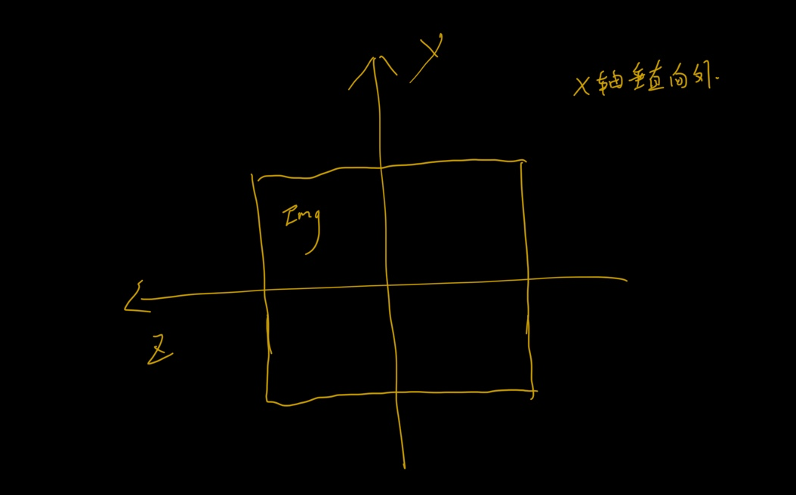
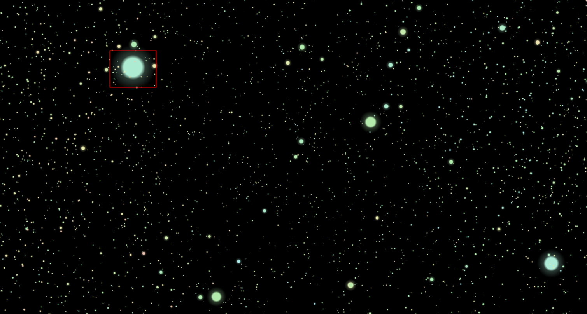

### ImagePoint

图片粒子特效

### 实现效果


### 实现步骤

1. **用Canvas读取图片像素，并对像素点进行筛选。筛选可根据RGB色值进行筛选，并进行疏密度控制。进行点位的初始,图片位置如下:**

   

   ```typescript
   // 读取像素
   const canvas: HTMLCanvasElement = document.createElement('canvas');
   const ctx: CanvasRenderingContext2D = canvas.getContext('2d')!;
   canvas.width = /** 要读取的宽度 **/;
   canvas.height = /** 要读取的高度 **/;
   ctx.drawImage(/** Image实例 **/, 0, 0);
   const imageData = ctx.getImageData(0, 0, /** 要读取的宽度 **/, /** 要读取的高度 **/);
   
   const { data, width, height } = imgData;
   // density为密度控制参数
   for (let x = 0; x < width / density; x += 1) {
       for (let y = 0; y < height / density; y += 1) {
           const i = (x * density + y * density * width) * 4;
           if (/** 像素点筛选逻辑 **/) {
               // 处理图片位置(x, y, z)
               points.push(0, height / 2 - y * density, width / 2 - x * density);
       	}
   	}
   }
   
   ```

   

2. **使用ShaderMaterial绘制像素点。**

   + 定义像素点颜色，这里使用的是hsl色值

     ```typescript
     const color =
     	new THREE.Color(`hsl(${(positions[i * 3 + 2] + positions[i * 3 + 1] + this.imageOptions.width) / 5}, 60%, 80%)`,
     ```

   + 定义Texture，长得这个样子：

     

     ```typescript
     function circularGradient(radius: number): THREE.Texture {
         const canvas = document.createElement('canvas');
         canvas.width = radius * 2;
         canvas.height = radius * 2;
         const ctx = canvas.getContext('2d')!;
         const grad = ctx.createRadialGradient(radius, radius, radius / 4, radius, radius, radius);
         grad.addColorStop(0.2, 'rgba(255, 255, 255, 1)');
         grad.addColorStop(0.4, 'rgba(255, 255, 255, .25)');
         grad.addColorStop(1, 'rgba(255, 255, 255, 0)');
         ctx.fillStyle = grad;
         ctx.arc(radius, radius, radius, 0, Math.PI / 180, true);
         ctx.fill();
         const texture = new THREE.Texture(canvas);
         texture.minFilter = THREE.NearestFilter;
         texture.needsUpdate = true;
         return texture;
       }
     ```

   + 定义 顶点着色器

     ```glsl
     /** 由JS传入 及之前获取的色值和位置等 **/
     attribute vec3 pointColor;
     attribute float pointOpacity;
     attribute float pointSize;
     
     /**
       varying变量是vertex和fragment shader之间做数据传递用的。
       一般vertex shader修改varying变量的值，然后fragment shader使用该varying变量的值。
       因此varying变量在vertex和fragment shader二者之间的声明必须是一致的
     **/
     varying vec3 color;
     varying float opacity;
     
     void main() {
       color = pointColor;
       opacity = pointOpacity;
       // modelViewMatrix 模型矩阵
       vec4 mvPosition = modelViewMatrix * vec4(position, 1.0);
       // gl_PointSize也是只能用在顶点语言中，顶点着色器用它来写入将要光栅化的点的尺寸，单位是像素
       gl_PointSize = pointSize * (300.0 / length(mvPosition.xyz));
       // projectionMatrix 投影矩阵
       gl_Position = projectionMatrix * mvPosition;
     }
     ```

   + 定义片段着色器

     ```glsl
     // uniform变量是外部程序传递给（vertex和fragment）shader的变量
     uniform sampler2D pointTexture;
     
     varying vec3 color;
     varying float opacity;
     
     void main() {
       gl_FragColor = vec4(color, opacity) * texture2D(pointTexture, gl_PointCoord);
     }
     
     ```

3. **粒子动效。主要是在开始运动时给每个粒子添加一个初速度，然后减速某个阈值以下，再给添加回归的速度（这个速度同时不断衰减）。**

   1. 初速度向量生成。

      ```typescript
      // 随机生成极坐标(radius, radZ, radX) => (长度， 与z轴夹角，于x轴夹角)
      const x = radius * Math.sin(radZ) * Math.cos(radX);
      const y = radius * Math.sin(radZ) * Math.sin(radX);
      const z = radius * Math.cos(radZ);
      // 速度向量
      const velocityVector = new Vector3(x, y, z)
      ```

   2. 减速。

      ```typescript
      // coefficient为减速系数， 约小粒子跑出去的距离越大
      // 等于每次减速coefficient%
      velocityVector.multiplyScalar(1 - coefficient);
      ```

   3. 回归。

      ```typescript
      // coefficient为回归系数， 约大回归越快
      // initPosition为初始位置 position为当前位置
      // 初始位置 - 当前位置 就是回归向量， 回归向量 * 回归系数 为回归速度
      const velocity = initPosition.clone().sub(position);
      velocity.multiplyScalar(coefficient);
      velocityVectors[index].add(velocity);
      
      // 回归的同时 执行回归速度的递减
      velocityVector.multiplyScalar(1 - coefficient);
      ```

   4. 更新位置

      ```typescript
      position.add(velocityVector)
      ```

      

   PS:  此DEMO 仿写 [sketch-threejs](https://github.com/ykob/sketch-threejs)中的image_data